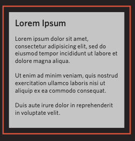
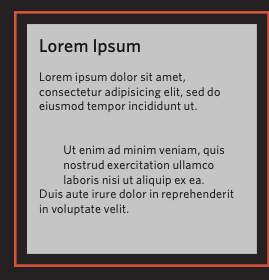
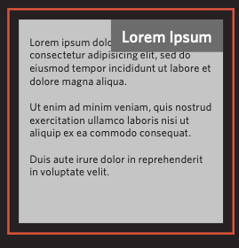
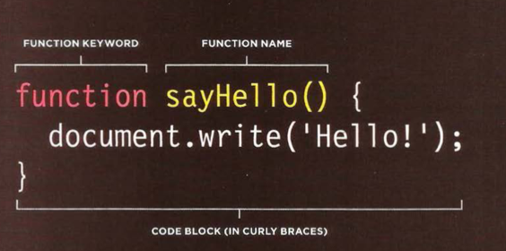

 
# Today we are going to talk about HTML Links, CSS Layout, JS Functions

> # 1. HTML Links:

### Links are the defining feature of the web because they allow you to move from one web page to another

> **>> Outline <<**

1. Creating links between pages
 1. Linking to other sites
 2. Email links
 
**In General**:

Links are created using the `<a>` element which has an attribute called href. The value of the href attribute is the page that you want people to go to when they click on the link.

***> Writing Links***

Links are created using the `<a> element. Users can click on anything between the opening <a>` tag and the closing `</a>` tag. You specify which page you want to link to using the href attribute.

**In details:**

    > Creating links between pages on the same site:
When you are linking to other pages within the same site,  
you do not need to specify the domain name in the URL. You can use a shorthand known as a relative URL.

If all the pages of the site are in the same folder, then the value of the href attribute is just the name of the file.
 

    <li><a href="index.html">Home</a></li>
    <li> <a href="about-us.html">About</a></li>
  

 **Relative URLs:**

When linking to other pages within the same site, you can use relative URLs. These are like a shorthand version of absolute URLs because you do not need to specify the domain name.

    > Linking to other sites:
When you link to a different website, the value of the href attribute will be the full web address for the site, which is known as an absolute URL.
Browsers show links in blue with an underline by default.

**Code:**

    
Movie Reviews: <ul>
    
    <li><a href="http://www.empireonline.com"> Empire</a></li>
    
    <li><a href="http://www.metacritic.com"> Metacritic</a></li>
    
    <li><a href="http://www.rottentomatoes.com"> Rotten Tomatoes</a></li>
    
    <li><a href="http://www.variety.com"> Variety</a></li>

</ul> 

**Result**

Movie Reviews: <ul>

<li><a href="http://www.empireonline.com"> Empire</a></li>

<li><a href="http://www.metacritic.com"> Metacritic</a></li>

<li><a href="http://www.rottentomatoes.com"> Rotten Tomatoes</a></li>

<li><a href="http://www.variety.com"> Variety</a></li>

</ul> 

    > Email links: By (mailto):
To create a link that starts up the user's email program and addresses an email to a specified email address, you use the `<a>` element. However, this time the value of the href attribute starts with mailto: and is followed by the email address you want the email to be sent to.

On the right you can see that an email link looks just like any other link but, when it is clicked on, the user's email program will open a new email message and address it to the person specified in the link.

Code:

    <a href="mailto:shadizaqout@gmail.com">Shadi M. Zaqout</a>

Result:
<a href="mailto:shadizaqout@gmail.com">Shadi M. Zaqout</a>

> # 2. CSS Layout:

### In this article  we are going to look at how to control where each element sits on a page and how to create attractive page layouts.
 **Building Blocks**
 
CSS treats each HTML element as if it is in its own box. This box will either be a block-level box or an inline box.
Block-level boxes start on a new line and act as the main building blocks of any layout, while inline boxes flow between surrounding text. You can control how much space each box takes up by setting the width of the boxes (and sometimes the height, too). To separate boxes, you can use borders, margins, padding, and background colors.

**Controlling the position of elements**:
	**Normal flow**

	Every block-level element appears on a new line, causing each item to appear lower down the page than the previous one. Even if you specify the width  
of the boxes and there is space for two elements to sit side-by- side, they will not appear next to each other. This is the default behavior (unless you tell the browser to do something else).

The paragraphs appear one after the other, vertically down the page.

**Relative Positioning**

This moves an element from the position it would be in normal flow, shifting it to the top, right, bottom, or left of where it would have been placed. This does not affect the position of surrounding elements; they stay in the position they would be in in normal flow.

**Absolute Positioning**

This positions the element  
in relation to its containing element. It is taken out of normal flow, meaning that it does not affect the position  
of any surrounding elements (as they simply ignore the space it would have taken up). Absolutely positioned elements move as users scroll up and down the page.

> # 3. JavaScript Function: 

A function is a series of statements that do something, such as calculate a value, perform a task, or complete another action. The difference between writing a function and just writing a bunch of statements is that a function encapsulates what you want to do. You get to use it again in a way similar to how we use variables to hold data types.

### Define a function using the keyword function, followed by a name, followed by parentheses. Insert the code to be executed by the function inside curly brackets and don't forget to add semicolons:

function sayHello() {
    alert("Hello");
};

You defined the function, but did not yet call or execute it.

Type sayHello(); to call the function by its name and a set of parentheses (). You just executed your function!

sayHello();

While this was a good step, we want a function that takes in some data (also called parameters) and does something with it.

## Make a version of sayHello() that greets you by name, like so:

function sayHello(name) {
  alert("Hello " + name);
};

Here we now have a function called "sayHello" that takes a parameter as an input in its parantheses called "name". Inside the function, we create an alert that displays "Hello " followed by the value of name that was input to the function.

Now call it with your name as a string in place of name. Don’t forget the quotes:

sayHello("Shadi hahahahha");

## return Keyword

// With return
function sum(num1, num2) {
  return num1 + num2;
}

Without return, so the function doesn't output the sum

function sum(num1, num2) {
  num1 + num2;
}

functions return (pass back) values using the return keyword. return ends function execution and returns the specified value to the location where it was called. A common mistake is to forget the return keyword, in which case the function will return undefined by default.

