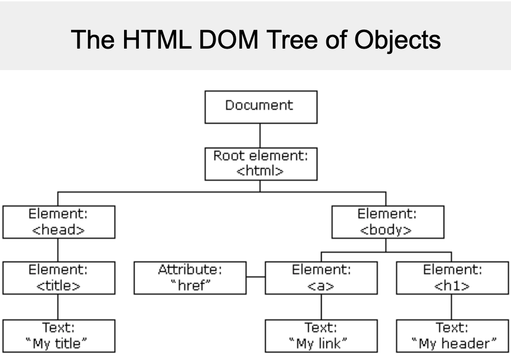

# Today's topics are interestin and very Important:

**>  1. JavaScript Object Literal**
**>  2. Document Object Model**
 

> # 1. JavaScript Object Literal:
 A JavaScript object literal is a comma-separated list of name-value pairs wrapped in curly braces. Object literals encapsulate data, enclosing it in a tidy package. This minimizes the use of global variables which can cause problems when combining code.

The following demonstrates an example object literal:

    var myObject = {
        sProp: 'some string value',
        numProp: 2,
        bProp: false
    };

Object literal property values can be of any data type, including array literals, functions, and nested object literals. Here is another object literal example with these property types:

    var Swapper = {
        // an array literal
        images: ["smile.gif", "grim.gif", "frown.gif", "bomb.gif"],
        pos: { // nested object literal
            x: 40,
            y: 300
        },
        onSwap: function() { // function
            // code here
        }
    };
    
## Object Literal Syntax
Object literals are defined using the following syntax rules:

-   A colon separates property name from value.
-   A comma separates each name-value pair from the next.
-   There should be no comma after the last name-value pair.
If any of the syntax rules are broken, such as a missing comma or colon or curly brace, a JavaScript error will be triggered. Browser error messages are helpful in pointing out the general location of object literal syntax errors, but they will not necessarily be completely accurate in pointing out the nature of the error.

> # 2. Document Object Model:
When a web page is loaded, the browser creates a  **D**ocument  **O**bject  **M**odel of the page.
The  **HTML DOM**  model is constructed as a tree of  **Objects**:

> 
**> With the object model, JavaScript gets all the power it needs to create dynamic HTML:**

-   JavaScript can change all the HTML elements in the page
-   JavaScript can change all the HTML attributes in the page
-   JavaScript can change all the CSS styles in the page
-   JavaScript can remove existing HTML elements and attributes
-   JavaScript can add new HTML elements and attributes
-   JavaScript can react to all existing HTML events in the page
-   JavaScript can create new HTML events in the page

## What is the DOM?

The DOM is a W3C (World Wide Web Consortium) standard.

The DOM defines a standard for accessing documents:

_"The W3C Document Object Model (DOM) is a platform and language-neutral interface that allows programs and scripts to dynamically access and update the content, structure, and style of a document."_

The W3C DOM standard is separated into 3 different parts:

-   Core DOM - standard model for all document types
-   XML DOM - standard model for XML documents
-   HTML DOM - standard model for HTML documents

----------

## What is the HTML DOM?

The HTML DOM is a standard  **object**  model and  **programming interface**  for HTML. It defines:

-   The HTML elements as  **objects**
-   The  **properties**  of all HTML elements
-   The  **methods**  to access all HTML elements
-   The  **events**  for all HTML elements

In other words: **The HTML DOM is a standard for how to get, change, add, or delete HTML elements.**
